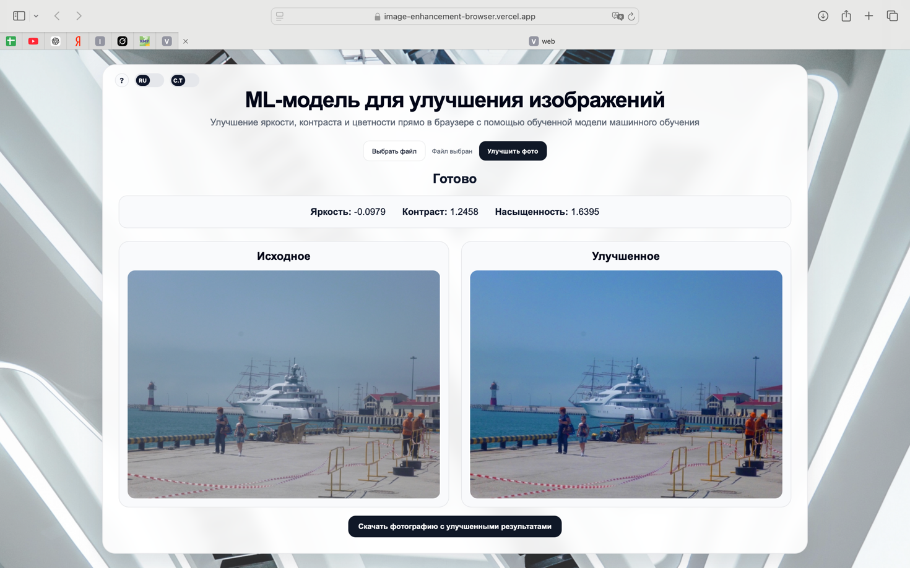

# ML-модель для улучшения изображений в браузере

Веб-приложение для автоматического улучшения изображений прямо в браузере пользователя с помощью обученной ML-модели.  
Система предсказывает оптимальные параметры коррекции и применяет их к изображению без участия пользователя.

**Демо:** https://image-enhancement-browser.vercel.app/

## Внешний вид проекта



## О проекте

Проект решает задачу автоматического подбора параметров улучшения изображения по трём признакам:

- яркость
- контраст
- цветность

Пользователь загружает фотографию в интерфейс, после чего модель вычисляет значения коррекции, а приложение отображает:

- исходное изображение
- улучшенное изображение
- предсказанные параметры обработки
- статус выполнения задачи
- прогресс обработки
- возможность скачать результат

Обработка выполняется на стороне клиента в браузере.

## Как обучалась модель

Для подготовки ML-части был использован датасет исходных фотографий в высоком качестве.  
Далее на основе оригинальных изображений был сформирован деградированный набор данных: к фотографиям применялись искажения по яркости, контрасту и цветности.  
В результате для обучения использовались пары вида:

- исходное изображение
- искусственно ухудшенное изображение
- целевые параметры коррекции

На таком наборе данных модель обучалась предсказывать значения коррекции, позволяющие приблизить деградированное изображение к исходному.

## Преимущества решения

- обработка изображений выполняется локально в браузере пользователя;
- не требуется отдельный backend-сервис для инференса модели;
- интерфейс поддерживает два языка: русский и английский;
- реализованы светлая и тёмная темы оформления;
- предусмотрено отображение статуса задачи и прогресса выполнения;
- пользователь может отменить обработку во время выполнения;
- поддерживаются популярные форматы изображений: JPG, JPEG, PNG, HEIC, BMP;
- результат отображается вместе с исходным изображением для наглядного сравнения;
- улучшенное изображение можно скачать сразу после завершения обработки;
- проект имеет разделение на ML-часть и web-часть, что упрощает сопровождение и развитие системы;
- проект реализован в компактной структуре и не содержит избыточной прикладной логики;
- объём авторского кода решения, включая ML-модуль, frontend-логику, конфигурацию и необходимые публичные ресурсы для работы приложения, укладывается в требование по ограничению суммарного объёма кода.

## Основной функционал

- загрузка изображений через веб-интерфейс
- поддержка форматов JPG, JPEG, PNG, HEIC, BMP
- автоматическое улучшение изображения
- отображение прогресса обработки
- вывод статуса задачи
- отмена обработки
- просмотр исходного и улучшенного изображений
- скачивание результата
- переключение темы интерфейса
- переключение языка интерфейса RU / EN
- информационный блок о модели

## Демонстрация

После загрузки изображения система:

1. создает задачу обработки
2. отображает текущий статус
3. показывает прогресс выполнения
4. предсказывает параметры коррекции
5. применяет улучшение
6. выводит готовый результат

## Используемые технологии

### ML-часть
- Python
- PyTorch
- ONNX

### Frontend
- React
- Vite
- JavaScript
- CSS

### Выполнение модели в браузере
- ONNX Runtime Web

## Архитектура решения

Проект состоит из двух основных частей:

### 1. ML-модуль
Отвечает за:
- подготовку датасета
- обучение модели
- экспорт модели в ONNX
- проверку качества модели

### 2. Web-приложение
Отвечает за:
- загрузку пользовательского изображения
- постановку задачи обработки
- получение статуса и прогресса
- запуск модели в браузере
- применение предсказанных параметров к изображению
- отображение и скачивание результата

## Логика работы системы

1. Пользователь загружает изображение
2. Создается задача обработки
3. Изображение приводится к нужному формату для модели
4. ML-модель предсказывает:
   - brightness
   - contrast
   - saturation
5. Вспомогательный алгоритм применяет эти параметры к изображению
6. Пользователь получает улучшенную версию и может скачать результат

## Структура проекта

```text
image-enhancement-browser/
├── app_ml/            # обучение, модели, экспорт, инференс
├── artifacts/         # сохранённые модели и служебные артефакты
├── data/              # данные и служебные файлы датасета
├── docs/              # документация по проекту
├── scripts/           # вспомогательные скрипты
├── web/               # frontend-приложение
│   ├── public/
│   ├── src/
│   │   ├── app/
│   │   ├── features/
│   │   ├── lib/
│   │   └── styles/
│   └── package.json
└── README.md